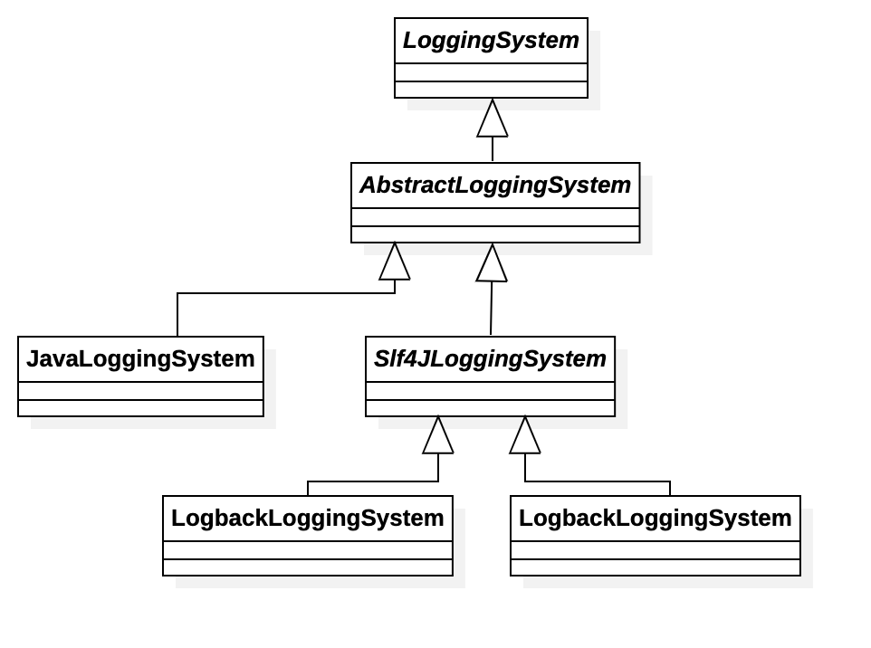

# LoggingApplicationListener

<!-- @import "[TOC]" {cmd="toc" depthFrom=1 depthTo=6 orderedList=false} -->

<!-- code_chunk_output -->

- [LoggingApplicationListener](#loggingapplicationlistener)
  - [1 ApplicationStartingEvent 事件](#1-applicationstartingevent-事件)
    - [1.1 获取对应的 LoggingSystem](#11-获取对应的-loggingsystem)
    - [1.2 loggingSystem.beforeInitialize()](#12-loggingsystembeforeinitialize)
  - [2 ApplicationEnvironmentPreparedEvent 事件](#2-applicationenvironmentpreparedevent-事件)
  - [3 ApplicationPreparedEvent 事件](#3-applicationpreparedevent-事件)
  - [4 ContextClosedEvent、ApplicationFailedEvent 事件](#4-contextclosedevent-applicationfailedevent-事件)

<!-- /code_chunk_output -->

LoggingApplicationListener 的作用就是在 Spring 启动时 配置日志系统。
看看其定义：
 ```java
 public class LoggingApplicationListener implements GenericApplicationListener
 ```
可以看到 `LoggingApplicationListener` 实现了 `GenericApplicationListener`， `GenericApplicationListener` 是针对 ApplicationListener的扩展提供了支持的事件类型和资源类型。现在我们看看主要的几方法。
 ```java
    private static final Class<?>[] EVENT_TYPES = { ApplicationStartingEvent.class,
			ApplicationEnvironmentPreparedEvent.class, ApplicationPreparedEvent.class, ContextClosedEvent.class,
			ApplicationFailedEvent.class };

	private static final Class<?>[] SOURCE_TYPES = { SpringApplication.class, ApplicationContext.class };
	
	@Override
	public boolean supportsEventType(ResolvableType resolvableType) {
		return isAssignableFrom(resolvableType.getRawClass(), EVENT_TYPES);
	}

	@Override
	public boolean supportsSourceType(Class<?> sourceType) {
		return isAssignableFrom(sourceType, SOURCE_TYPES);
	}

	private boolean isAssignableFrom(Class<?> type, Class<?>... supportedTypes) {
		if (type != null) {
			for (Class<?> supportedType : supportedTypes) {
				if (supportedType.isAssignableFrom(type)) {
					return true;
				}
			}
		}
		return false;
	}

	@Override
	public void onApplicationEvent(ApplicationEvent event) {
        //根据不同的事件，调用对应的方法
		if (event instanceof ApplicationStartingEvent) {
			onApplicationStartingEvent((ApplicationStartingEvent) event);
		}
		else if (event instanceof ApplicationEnvironmentPreparedEvent) {
			onApplicationEnvironmentPreparedEvent((ApplicationEnvironmentPreparedEvent) event);
		}
		else if (event instanceof ApplicationPreparedEvent) {
			onApplicationPreparedEvent((ApplicationPreparedEvent) event);
		}
		else if (event instanceof ContextClosedEvent
				&& ((ContextClosedEvent) event).getApplicationContext().getParent() == null) {
			onContextClosedEvent();
		}
		else if (event instanceof ApplicationFailedEvent) {
			onApplicationFailedEvent();
		}
	}
 ```
可以看到 LoggingApplicationListener 监听了多个 Spring 启动时的事件。
每个事件都有具体需要做的相关配置

## 1 ApplicationStartingEvent 事件
 ```java
	private void onApplicationStartingEvent(ApplicationStartingEvent event) {
		//获取对应的LoggingSystem
		this.loggingSystem = LoggingSystem.get(event.getSpringApplication().getClassLoader());
		//并做LoggingSystem初始化前的准备
		this.loggingSystem.beforeInitialize();
	}
 ```
可以看到 StartingEvent 事件其实就做了2件事:
1. 获取 对应的 LoggingSystem；
2. LoggingSystem 初始化前的准备；

### 1.1 获取对应的 LoggingSystem
先来看看 `LoggingSystem.get` 方法
 ```java

    private static final Map<String, String> SYSTEMS;

	static {
		Map<String, String> systems = new LinkedHashMap<>();
		systems.put("ch.qos.logback.core.Appender", "org.springframework.boot.logging.logback.LogbackLoggingSystem");
		systems.put("org.apache.logging.log4j.core.impl.Log4jContextFactory",
				"org.springframework.boot.logging.log4j2.Log4J2LoggingSystem");
		systems.put("java.util.logging.LogManager", "org.springframework.boot.logging.java.JavaLoggingSystem");
		SYSTEMS = Collections.unmodifiableMap(systems);
	}

    /**
	 * Detect and return the logging system in use. Supports Logback and Java Logging.
	 * 检测并返回正在使用的日志系统。支持Logback和Java日志记录。
	 * @param classLoader the classloader
	 * @return the logging system
	 */
	public static LoggingSystem get(ClassLoader classLoader) {
		//获取系统配置 org.springframework.boot.logging.LoggingSystem
		String loggingSystem = System.getProperty(SYSTEM_PROPERTY);
		//如果存在则直接返回
		if (StringUtils.hasLength(loggingSystem)) {
			if (NONE.equals(loggingSystem)) {
				//返回一个什么都不做的对象
				return new NoOpLoggingSystem();
			}
			//根据配置 实例化 LoggingSystem
			return get(classLoader, loggingSystem);
		}
		//从 Spring 当前支持的日志系统中 查找对应的 jar包， 存在并 实例化返回。
		return SYSTEMS.entrySet().stream().filter((entry) -> ClassUtils.isPresent(entry.getKey(), classLoader))
				.map((entry) -> get(classLoader, entry.getValue())).findFirst()
				.orElseThrow(() -> new IllegalStateException("No suitable logging system located"));
	}
 ```
通过上面的源码，我们可以看到，其实总共就2步操作：
1. 判断系统配置中是否存在 `org.springframework.boot.logging.LoggingSystem` 配置，若有，则实例并返回。
2. 没有，则通过 `SYSTEMS` 变量中配置的 spring 说支持的几种日志系统，查找通过当前 `classLoader` 检测其是否存在，若存在，则实例化，并返回。

我们来看下 `LoggingSystem` 相关的类图:



spring 默认的日志是 logback 。那么我们就来看看其相关的代码吧。 spring 用于配置不同的日志系统的类都有具体的实现。`org.springframework.boot.logging.logback.LogbackLoggingSystem` 即是用于配置 logback 的。
 ```java
 public class LogbackLoggingSystem extends Slf4JLoggingSystem {
     public LogbackLoggingSystem(ClassLoader classLoader) {
		super(classLoader);
	}
    ....//省略其他代码
 }
 ```
### 1.2 loggingSystem.beforeInitialize()
经过第一步获取到了对应的 `LoggingSystem` , 就会调用 `this.loggingSystem.beforeInitialize()`;
 ```java
    @Override
	public void beforeInitialize() {
		//获取 logback 的 LoggerFactory
		LoggerContext loggerContext = getLoggerContext();
		if (isAlreadyInitialized(loggerContext)) {
			return;
		}
		//解除日志管理的绑定关系，从LogManager.getLogManager()中移除java.util.logging.ConsoleHandler
		//移除 SLF4JBridgeHandler
		//重新 绑定 SLF4JBridgeHandler
		super.beforeInitialize();
		//设置filter
		loggerContext.getTurboFilterList().add(FILTER);
	}
 ```

## 2 ApplicationEnvironmentPreparedEvent 事件
先来看看，处理该事件的方法：
 ```java
 private void onApplicationEnvironmentPreparedEvent(ApplicationEnvironmentPreparedEvent event) {
		//如果loggingSystem为空，就重新获取
		if (this.loggingSystem == null) {
			this.loggingSystem = LoggingSystem.get(event.getSpringApplication().getClassLoader());
		}
		//初始化
		initialize(event.getEnvironment(), event.getSpringApplication().getClassLoader());
	}
 ```
接下来，我们看看 `initialize` 方法做了什么
 ```java
 	/**
	 * Initialize the logging system according to preferences expressed through the
	 * {@link Environment} and the classpath.
	 * 根据通过 环境 和 classpath 表示的首选项来初始化日志系统
	 * @param environment the environment
	 * @param classLoader the classloader
	 */
	protected void initialize(ConfigurableEnvironment environment, ClassLoader classLoader) {
		//将 spring 环境的相关参数数据，设置到 LoggingSystemProperties 中
		//主要包含 spring boot 配置中的 logging.
		//exception-conversion-word,pattern.console、pattern.file、file.clean-history-on-start、file.max-history、file.max-size
		//file.total-size-cap、pattern.level、pattern.dateformat、pattern.rolling-file-name
		//参数转换成 相关log日志框架需要的配置，并设置到 jvm 环境中。
		new LoggingSystemProperties(environment).apply();
		//根据 spring 环境的参数，创建 logFile
		this.logFile = LogFile.get(environment);
		if (this.logFile != null) {
			//像 jvm 系统环境 添加 LOG_PATH , LOG_FILE 配置
			this.logFile.applyToSystemProperties();
		}
		//设置默认的default_group_loggers
		this.loggerGroups = new LoggerGroups(DEFAULT_GROUP_LOGGERS);
		//根据 spring 环境设置 提前初始化log level
		initializeEarlyLoggingLevel(environment);
		//初始化 LoggingSystem
		initializeSystem(environment, this.loggingSystem, this.logFile);
		//最后设置 log level
		initializeFinalLoggingLevels(environment, this.loggingSystem);
		//注册 jvm 关闭的钩子
		registerShutdownHookIfNecessary(environment, this.loggingSystem);
	}
 ```

## 3 ApplicationPreparedEvent 事件
该事件其实就是把之前初始化的相关bean，注册到beanFactory中，代码如下：
 ```java
 	/**
	 * application准备事件，针对 LoggingApplicationListener 主要功能，就是注册向 beanFactory 对应的 loggingSystem,logFile,loggerGroups
	 * @param event
	 */
	private void onApplicationPreparedEvent(ApplicationPreparedEvent event) {
		ConfigurableListableBeanFactory beanFactory = event.getApplicationContext().getBeanFactory();
		if (!beanFactory.containsBean(LOGGING_SYSTEM_BEAN_NAME)) {
			beanFactory.registerSingleton(LOGGING_SYSTEM_BEAN_NAME, this.loggingSystem);
		}
		if (this.logFile != null && !beanFactory.containsBean(LOG_FILE_BEAN_NAME)) {
			beanFactory.registerSingleton(LOG_FILE_BEAN_NAME, this.logFile);
		}
		if (this.loggerGroups != null && !beanFactory.containsBean(LOGGER_GROUPS_BEAN_NAME)) {
			beanFactory.registerSingleton(LOGGER_GROUPS_BEAN_NAME, this.loggerGroups);
		}
	}
 ```
## 4 ContextClosedEvent、ApplicationFailedEvent 事件
这两个事件，就是在 spring application 关闭或启动失败，执行的事件，主要是清空之前初始化的对象。
