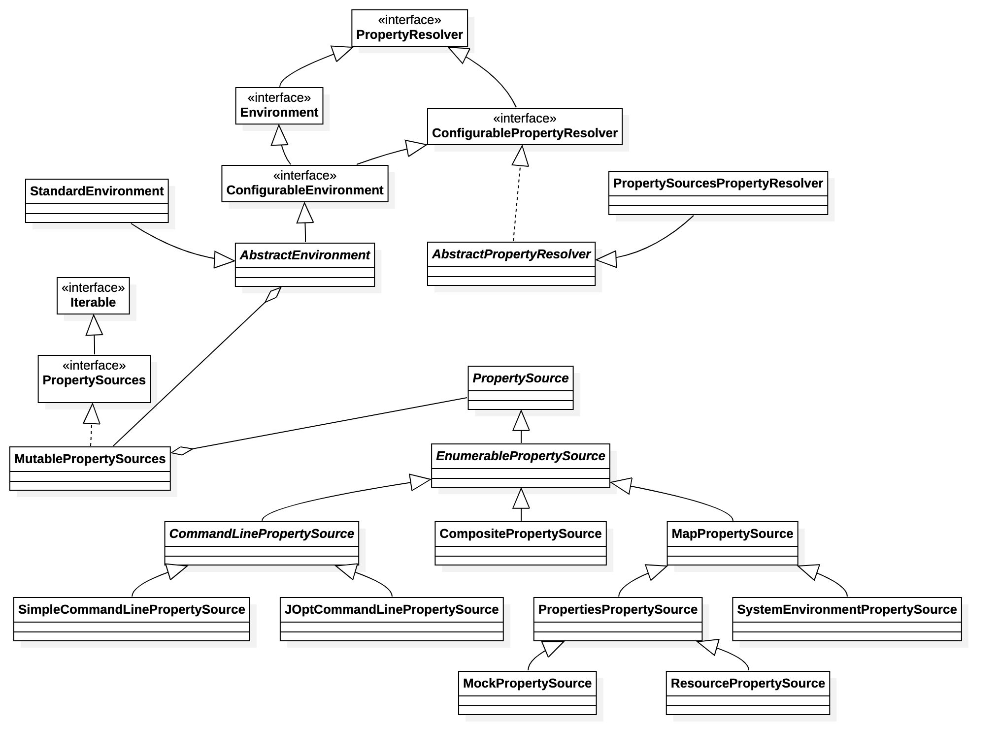

# PropertySource
&emsp;&emsp;先看下 spring `PropertySource` 相关的类图

&emsp;&emsp;可以看到主要分为三部分：
1. **PropertySource**
&emsp;&emsp;`PropertySource` 抽象类，定了一个 name/value 的配置类，但是一般不单独使用，而是通过 `PropertySources` 和 PropertyResolver 来处理。我们来看下它的源码：
 ```java
 public abstract class PropertySource<T> {

	protected final Log logger = LogFactory.getLog(getClass());

	protected final String name;

	protected final T source;


	/**
	 * Create a new {@code PropertySource} with the given name and source object.
	 * 创建一个资源
	 */
	public PropertySource(String name, T source) {
		Assert.hasText(name, "Property source name must contain at least one character");
		Assert.notNull(source, "Property source must not be null");
		this.name = name;
		this.source = source;
	}

	/**
	 * Create a new {@code PropertySource} with the given name and with a new
	 * {@code Object} instance as the underlying source.
	 * <p>Often useful in testing scenarios when creating anonymous implementations
	 * that never query an actual source but rather return hard-coded values.
	 */
	@SuppressWarnings("unchecked")
	public PropertySource(String name) {
		this(name, (T) new Object());
	}


	/**
	 * Return the name of this {@code PropertySource}.
	 */
	public String getName() {
		return this.name;
	}

	/**
	 * Return the underlying source object for this {@code PropertySource}.
	 */
	public T getSource() {
		return this.source;
	}

	/**
	 * Return whether this {@code PropertySource} contains the given name.
	 * <p>This implementation simply checks for a {@code null} return value
	 * from {@link #getProperty(String)}. Subclasses may wish to implement
	 * a more efficient algorithm if possible.
	 * @param name the property name to find
	 */
	public boolean containsProperty(String name) {
		return (getProperty(name) != null);
	}

	/**
	 * Return the value associated with the given name,
	 * or {@code null} if not found.
	 * @param name the property to find
	 * @see PropertyResolver#getRequiredProperty(String)
	 */
	@Nullable
	public abstract Object getProperty(String name);


	/**
	 * This {@code PropertySource} object is equal to the given object if:
	 * <ul>
	 * <li>they are the same instance
	 * <li>the {@code name} properties for both objects are equal
	 * </ul>
	 * <p>No properties other than {@code name} are evaluated.
	 */
	@Override
	public boolean equals(@Nullable Object other) {
		return (this == other || (other instanceof PropertySource &&
				ObjectUtils.nullSafeEquals(this.name, ((PropertySource<?>) other).name)));
	}

	/**
	 * Return a hash code derived from the {@code name} property
	 * of this {@code PropertySource} object.
	 */
	@Override
	public int hashCode() {
		return ObjectUtils.nullSafeHashCode(this.name);
	}

	/**
	 * Produce concise output (type and name) if the current log level does not include
	 * debug. If debug is enabled, produce verbose output including the hash code of the
	 * PropertySource instance and every name/value property pair.
	 * <p>This variable verbosity is useful as a property source such as system properties
	 * or environment variables may contain an arbitrary number of property pairs,
	 * potentially leading to difficult to read exception and log messages.
	 * @see Log#isDebugEnabled()
	 */
	@Override
	public String toString() {
		if (logger.isDebugEnabled()) {
			return getClass().getSimpleName() + "@" + System.identityHashCode(this) +
					" {name='" + this.name + "', properties=" + this.source + "}";
		}
		else {
			return getClass().getSimpleName() + " {name='" + this.name + "'}";
		}
	}


	/**
	 * Return a {@code PropertySource} implementation intended for collection comparison purposes only.
	 * <p>Primarily for internal use, but given a collection of {@code PropertySource} objects, may be
	 * used as follows:
	 * <pre class="code">
	 * {@code List<PropertySource<?>> sources = new ArrayList<PropertySource<?>>();
	 * sources.add(new MapPropertySource("sourceA", mapA));
	 * sources.add(new MapPropertySource("sourceB", mapB));
	 * assert sources.contains(PropertySource.named("sourceA"));
	 * assert sources.contains(PropertySource.named("sourceB"));
	 * assert !sources.contains(PropertySource.named("sourceC"));
	 * }</pre>
	 * The returned {@code PropertySource} will throw {@code UnsupportedOperationException}
	 * if any methods other than {@code equals(Object)}, {@code hashCode()}, and {@code toString()}
	 * are called.
	 * @param name the name of the comparison {@code PropertySource} to be created and returned.
	 */
	public static PropertySource<?> named(String name) {
		return new ComparisonPropertySource(name);
	}


	/**
	 * {@code PropertySource} to be used as a placeholder in cases where an actual
	 * property source cannot be eagerly initialized at application context
	 * creation time.  For example, a {@code ServletContext}-based property source
	 * must wait until the {@code ServletContext} object is available to its enclosing
	 * {@code ApplicationContext}.  In such cases, a stub should be used to hold the
	 * intended default position/order of the property source, then be replaced
	 * during context refresh.
	 * @see org.springframework.context.support.AbstractApplicationContext#initPropertySources()
	 * @see org.springframework.web.context.support.StandardServletEnvironment
	 * @see org.springframework.web.context.support.ServletContextPropertySource
	 */
	public static class StubPropertySource extends PropertySource<Object> {

		public StubPropertySource(String name) {
			super(name, new Object());
		}

		/**
		 * Always returns {@code null}.
		 */
		@Override
		@Nullable
		public String getProperty(String name) {
			return null;
		}
	}


	/**
	 * A {@code PropertySource} implementation intended for collection comparison
	 * purposes.
	 *
	 * @see PropertySource#named(String)
	 */
	static class ComparisonPropertySource extends StubPropertySource {

		private static final String USAGE_ERROR =
				"ComparisonPropertySource instances are for use with collection comparison only";

		public ComparisonPropertySource(String name) {
			super(name);
		}

		@Override
		public Object getSource() {
			throw new UnsupportedOperationException(USAGE_ERROR);
		}

		@Override
		public boolean containsProperty(String name) {
			throw new UnsupportedOperationException(USAGE_ERROR);
		}

		@Override
		@Nullable
		public String getProperty(String name) {
			throw new UnsupportedOperationException(USAGE_ERROR);
		}
	}

 }
 ```
这里我们主要讲一下 containsProperty 和 named 方法
`named`方法为了创建一个ComparisonPropertySource，与eqauls配合，判断 PropertySource 集合，否存在 name 的的配置 PropertySource
通过注释我们我们可以看到相关的说明。通过`equals`方法的重写，判断两个 PropertySource 是否相同。
`containsProperty`方法是直接调用 `getProperty` 也就是说，具体的实现是由子类来处理的。

1. **PropertySources**
&emsp;&emsp;`PropertySources` 是一个接口，包含一个或多个`PropertySource`的持有。
1. **PropertyResolver**
&emsp;&emsp;`PropertyResolver` 也是一个接口，主要是针对任何潜来源，解析 properties 属性。

## 1. PropertySource
&emsp;&emsp;可以看到 `PropertySource` 的类图关系，定义了一个 `EnumerablePropertySource` 抽象类，其他子类都是继承至它
### 1.1 EnumerablePropertySource
&emsp;&emsp;从命名 `Enumerable` 可以看出，该 `PropertySource` 是一个可列举 `PropertySource`;我们看下它的相关介绍

